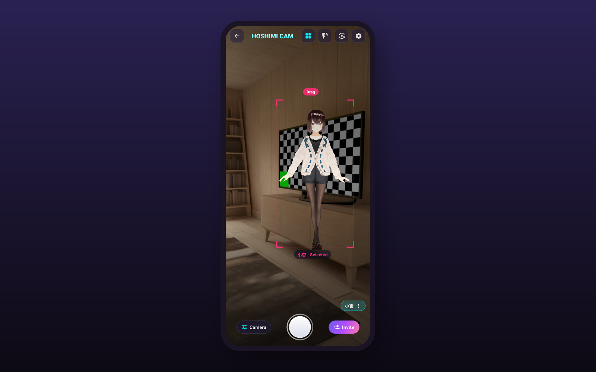
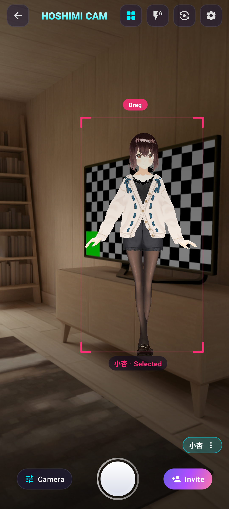
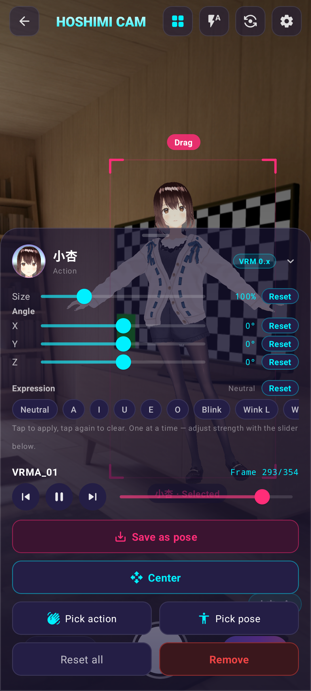

# Magic Camera

Take photos with your virtual characters.

Magic Camera blends your live camera feed with VRM avatars. Place a character in the shot, give
her a pose, an action or an expression, and shoot — what lands in your gallery looks like she was
standing there.

<!-- 图片由 publish-release.ps1 从 marketing/aihow-work/images/ 复制 -->


---

## Download

<!-- BEGIN:release-info -->
| | |
|---|---|
| **Version** | 1.0 |
| **Released** | 2026-09-29 |
| **Size** | 103.5 MB (108,545,098 bytes) |
| **SHA-256** | `062be1e954dd54643d4f417681cb654d79f1acf704f4d99c6e20833853f4f5f0` |
| **Requires** | Android 8.0 (API 26) or later |
| **Download** | [MagicCamera-1.0.apk](https://github.com/OWNER/REPO/releases/latest/download/MagicCamera-1.0.apk) |
<!-- END:release-info -->

> ⚠️ `OWNER/REPO` 是占位符 —— 建好公开仓库后请替换（发布脚本会提示）。

**Install**: download the APK, then allow "install unknown apps" for the browser or file manager
that downloaded it. The APK is about 100 MB — a Wi-Fi connection is recommended.

**Verify the download** (recommended):

```bash
sha256sum MagicCamera-1.0.apk
# 必须等于上面表格里的 SHA-256
```

**Permissions, and why they are needed**:

| Permission | Used for |
|---|---|
| Camera | Live preview and shooting |
| File access | Importing VRM models / action files from your `Download` folder |

There is no account, no sign-in, nothing uploaded anywhere. Photos go straight to your device's
gallery (`Pictures/MagicCamera`).

---

## What it does

- **Invite a character into your shot** — pick one from the library or import your own VRM file;
  drag, scale and rotate until the framing feels right.
- **Pose, perform, express** — 20+ expressions, saved poses and animated actions; freeze any frame
  mid-motion and shoot that exact moment.
- **A studio in your pocket** — framing, beauty, denoise, filters, zoom, grid, flash and front/back
  camera, all live on the preview.
- **Stills, clips, time-lapse** — three photo quality levels, video recording, timer and time-lapse.
- **Your room is the stage** — switch characters mid-scene; the app composites them over the live
  camera feed, so your room stays in the shot.
- **Speaks your language** — English, 中文, 日本語, 한국어, Deutsch, Français, Español, Italiano.




---

## Characters and actions

The app supports **VRM 0.x and 1.0** avatars, including their expressions, poses and actions.
Other glTF/GLB models can be imported too, but they often carry no facial blend shapes and no
humanoid rig, so expressions and actions stay unavailable for them.

**This project does not host or distribute any third-party assets.** To add content, download it
yourself from creator platforms — for example **BOOTH** — then use "Import" inside the app.
Whether an asset may be used, and how, is decided by its creator, not by this project:

- Sources and licence status of the built-in content: [`THIRD_PARTY_NOTICES.md`](THIRD_PARTY_NOTICES.md)
- Privacy: [`PRIVACY.md`](PRIVACY.md)
- Terms for the app itself: [`LICENSE.md`](LICENSE.md)

---

## FAQ

**Do I need an account?** No — no sign-up, no login, nothing to sync.

**Where do my photos go?** To your device's gallery, in `Pictures/MagicCamera`.

**How do I add my own character or action?** Download a `.vrm` / `.vrma` / `.fbx` / `.json` file
from a creator platform such as BOOTH, then use the app's import entry. Usage terms are set by the
creator; the app only imports the file locally.

**Is it open source?** No. This repository only publishes the compiled package. See `LICENSE.md`.

---

## Releases

See [`CHANGELOG.md`](CHANGELOG.md). Every release ships the APK as a GitHub Release asset.

---

**Magic Camera · 1.0 · © 2026 aihow.work**
